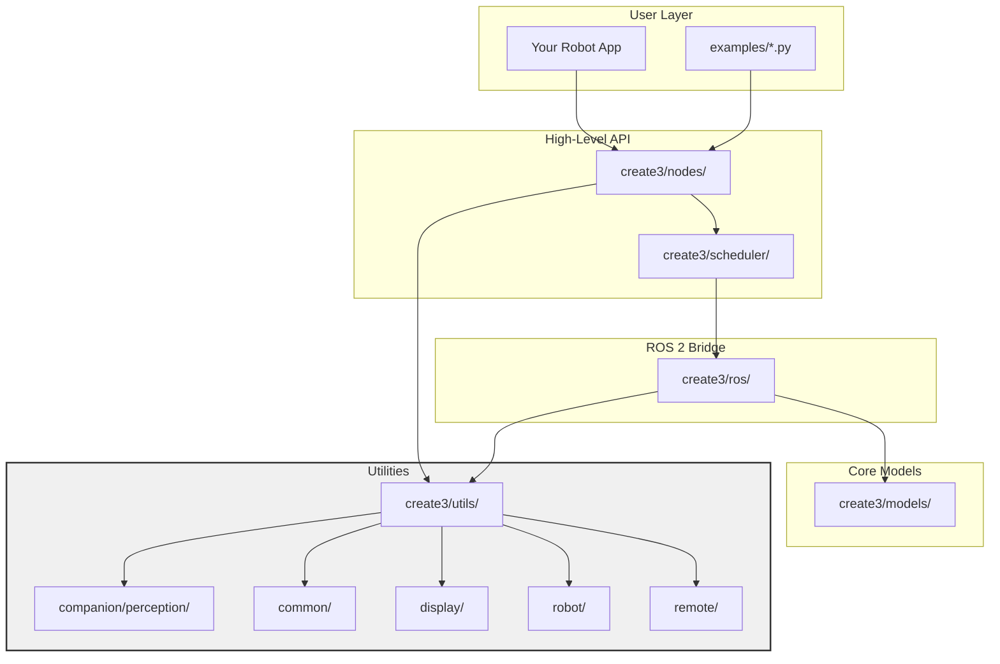

# iRobot Create 3 Python SDK

**A modern, full-featured ROS 2 Python SDK for the iRobot Create 3 robot (and companion/remote modes).**

This package provides a clean, high-level interface to control the Create 3, including advanced perception, task scheduling, PID control, lidar processing, wall following, music, lightring, and more.

---



---

## ✨ Features

- **Multi-mode support**: `robot`, `companion`, and `remote`
- **ROS 2 native**: Full integration with publishers, subscribers, actions, and services
- **Advanced perception**: Lidar, circle/line/arc detection, collision avoidance, wall following
- **Task scheduler**: Orchestrate complex behaviors with ease
- **PID tuner UI** + real-time controller
- **Display tools**: Point cloud visualization, controller overlay
- **Robot utilities**: Music, lightring, velocity constraints, IR sensors
- **Remote control**: Joystick + SLAM helpers
- **Ready-to-run examples**

---

## 📦 Installation

### Recommended: Install directly from GitHub (latest version)

```bash
pip install git+https://github.com/scottcandy34/irobot-create3-python-sdk.git
```

### Alternative: Install from local clone (for development)

```bash
git clone https://github.com/scottcandy34/irobot-create3-python-sdk.git
cd irobot-create3-python-sdk
pip install -e .
```

**Prerequisites**:
- ROS 2 Jazzy (or compatible)
- Python 3.10+
- `rclpy`, `geometry_msgs`, `nav_msgs`, etc. (automatically pulled via dependencies)

---

## 🚀 Quick Start

1. Make sure your Create 3 is powered on and connected to the same network as your computer.
2. Launch the robot's ROS 2 drivers (usually via the official Create 3 launch file).
3. Run any of the included examples:

```bash
# Example 1: Interactive PID Tuner
python -m examples.pid_tuner_example

# Example 2: Lidar coordinate points visualization
python -m examples.lidar_coordinate_points_example

# Example 3: Basic controller example
python -m examples.controller_example
```

---

## 🏗️ Package Structure

```
irobot-create3-python-sdk/
├── create3/                  # Main package
│   ├── models/               # Data models (objects, tasks, topics)
│   ├── nodes/                # High-level ROS nodes
│   ├── ros/                  # Low-level ROS interfaces
│   ├── scheduler/            # Task orchestration
│   ├── utils/                # Perception, display, robot helpers
├── examples/                 # Ready-to-run demos
├── setup.py
└── README.md
```

---

## 📚 Core Modules

- **`create3.RobotNode`** — Main robot interface
- **`create3.TaskScheduler`** — Run sequenced or parallel tasks
- **`create3.utils.display.ControllerVisualizer`** — Real-time visualization

---

## 🔧 Advanced Usage

After installation, you can import and use the SDK in your own scripts:

```python
from create3 import RobotNode
# etc.
```

Full API documentation is available in the docstrings and the `create3/models/` and `create3/utils/` modules.

---

## 🛠️ Troubleshooting

- **"No module named 'rclpy'"** → Make sure you're in a ROS 2 sourced terminal (`source /opt/ros/jazzy/setup.bash`)
- **Robot not responding** → Verify the Create 3 ROS bridge is running
- **Permission issues** → Run with `sudo` only if necessary (usually not)

---

## 📄 License

This project is licensed under the MIT License — see the [LICENSE](LICENSE) file for details.

---

## 🤝 Contributing

Pull requests welcome! Feel free to open issues for bugs or feature requests.

---

**Made with ❤️ for the Create 3 community**

*Version: 1.0.0 (April 2026)*
